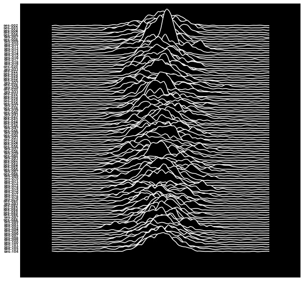

# MyConnectome meets Joy Division

Figure of distributions of MyConnectome global signals.  _Loosely_ based on the cover of Unknown Pleasures (Joy Division).

- `unknownpleasures.sh` contains constants and call to extract script
- `unknownpleasures_extract.py` extracts the global signal from each session with a resting state scan and writes all gs's to a csv.
- `unknownpleasures_figure.ipynb` creates the figure.

Preprocessing from BIDS (included in code):
- cut off first 10 timepoints
- apply mask, center
- average over all voxels
- For aesthetics: add a little random noise to distributions (mostly visible in tails), smoothed and left out 2 sessions with ugly peaky distributions.

*Dependencies:* singularity + [singularity container for fmriprep-1.1.5](https://hub.docker.com/r/poldracklab/fmriprep/tags/)

*Data:* MyConnectome preprocessed with fmriprep (available on openfmri)

